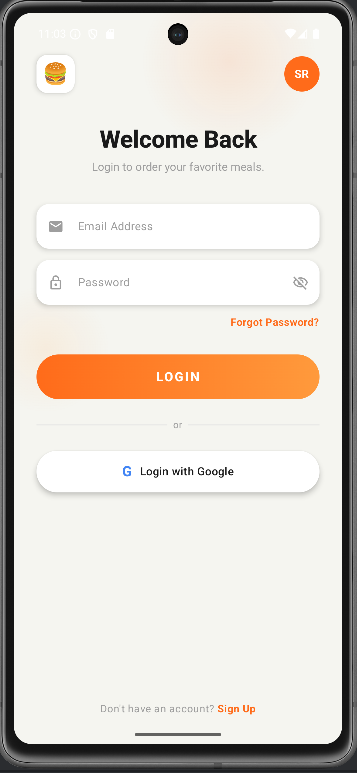
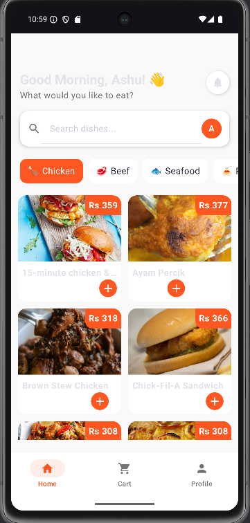
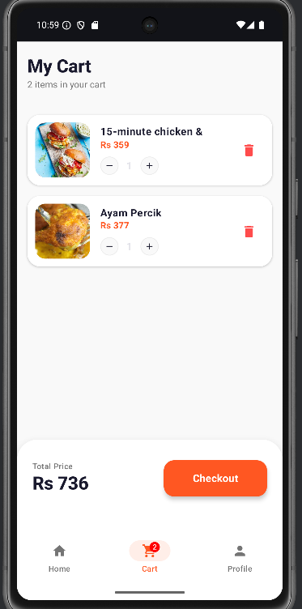

# 🍔 FoodOrder App

A high-performance, native Android application built using **Jetpack Compose** and **Clean Architecture**. This app integrates with **TheMealDB API** to provide real-time food browsing, a dynamic cart management system, and secure authentication via **Firebase**.

---

## 📸 App Screenshots

  
  
  

| Authentication | Smart Dashboard | My Cart |
| :--- | :--- | :--- |
| Firebase Email/Pass login and Firestore profile persistence. | Category-based filtering and real-time search functionality. | Full CRUD operations with instant billing and cart badges. |

---

## 🚀 Key Features

* **Real-time Menu:** Fetches live data from TheMealDB API using Ktor.
* **User Personalization:** Displays the registered user's name and initials dynamically from Firestore.
* **Dynamic Cart System:** * Add/Remove items with real-time bill calculation.
    * Shared ViewModel state across Home and Cart screens.
    * Bottom navigation badge showing current item count.
* **Modern UI/UX:** Built entirely with Jetpack Compose featuring smooth animations, custom chips, and Material 3 components.

---

## 🛠 Tech Stack

* **Language:** Kotlin
* **UI Framework:** Jetpack Compose (Material 3)
* **Networking:** Ktor Client (Content Negotiation + Kotlin Serialization)
* **Database/Backend:** * Firebase Authentication (User sessions)
    * Google Firestore (User profiles & metadata)
* **Image Loading:** Coil
* **Architecture:** MVVM (Model-View-ViewModel)
* **Asynchronous:** Kotlin Coroutines & StateFlow

---

